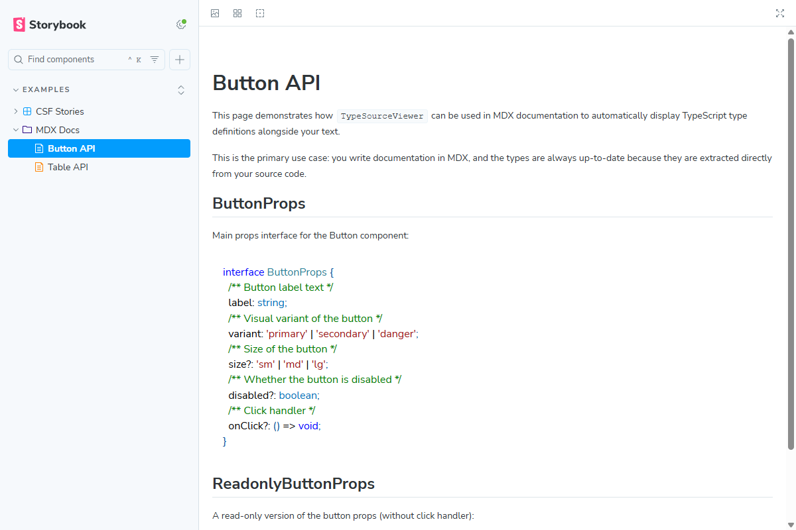
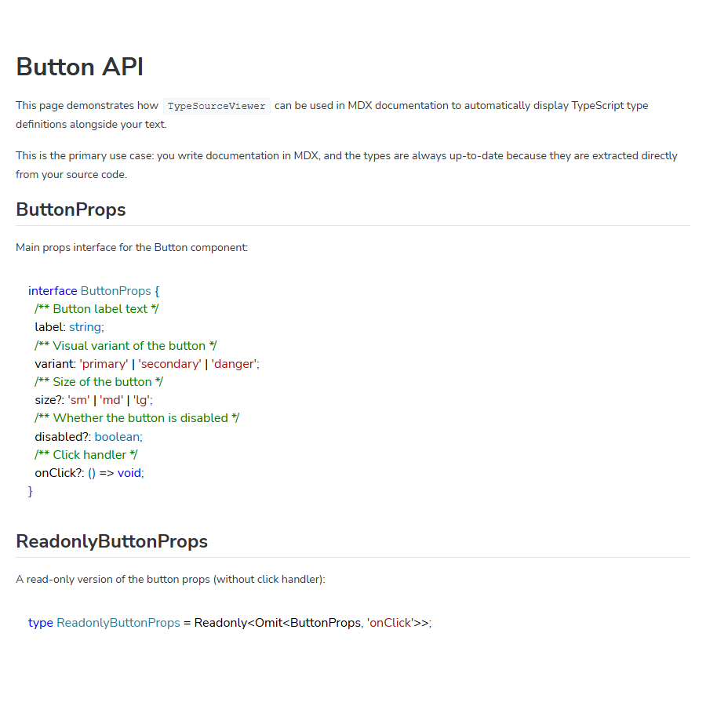
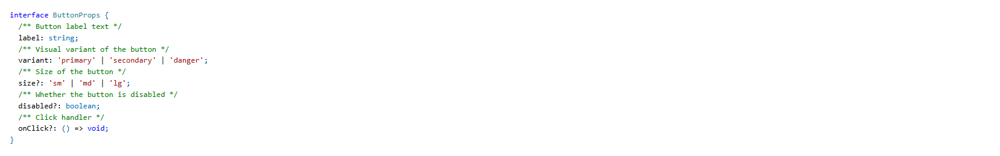

# type-source-viewer

Display **any** TypeScript type definition in your Storybook docs -- always in sync with the source code.



## The Problem

Storybook's built-in `ArgTypes` table shows component props, but what about:

- **Nested types** that your props reference?
- **Utility types** like `Readonly<Omit<ButtonProps, 'onClick'>>`?
- **Discriminated unions**, generics, `as const` objects?
- **Types that aren't component props** at all -- configs, API responses, store shapes?

You end up manually copying type definitions into your docs. They go stale. Nobody updates them.

## The Solution

**type-source-viewer** extracts type definitions directly from your `.ts` files at build time and renders them with syntax highlighting. JSDoc comments are preserved.

```
source code (.ts)  -->  Vite plugin (build time)  -->  Storybook / MDX / any app
```

- Zero runtime overhead -- types are extracted at build time
- Always up-to-date -- change the type, docs update automatically
- JSDoc comments preserved -- your documentation stays rich
- Syntax highlighting included -- powered by Prism

## Quick Start

```bash
pnpm add -D type-source-viewer
```

### Option 1: MDX Documentation (recommended)

The primary use case -- embed types directly in your Storybook MDX pages:

**1. Configure Vite plugin**

```ts
// .storybook/main.ts
import { typeViewerPlugin } from 'type-source-viewer/vite';
import { resolve } from 'path';

const config = {
  stories: ['../stories/**/*.stories.@(ts|tsx)', '../stories/**/*.mdx'],
  addons: ['@storybook/addon-essentials'],
  framework: '@storybook/react-vite',
  viteFinal: async (config) => {
    config.plugins = config.plugins ?? [];
    config.plugins.push(
      typeViewerPlugin({
        storybookDir: resolve(process.cwd(), 'stories'),
      }),
    );
    return config;
  },
};

export default config;
```

**2. Use in MDX**

```mdx
import { TypeSourceViewer } from 'type-source-viewer/storybook';

# Button API

## ButtonProps

<TypeSourceViewer
  filePath="./src/components/Button/types.ts"
  typeName="ButtonProps"
  language="tsx"
/>

## ReadonlyButtonProps

<TypeSourceViewer
  filePath="./src/components/Button/types.ts"
  typeName="ReadonlyButtonProps"
  language="tsx"
/>
```

**Result:**



### Option 2: CSF Stories

Use in regular `.stories.tsx` files -- great for interactive exploration with Controls:

```tsx
import type { Meta, StoryObj } from '@storybook/react';
import { TypeSourceViewer } from 'type-source-viewer/storybook';

const meta: Meta<typeof TypeSourceViewer> = {
  title: 'API/Button',
  component: TypeSourceViewer,
};

export default meta;

type Story = StoryObj<typeof TypeSourceViewer>;

export const ButtonProps: Story = {
  args: {
    filePath: './src/components/Button/types.ts',
    typeName: 'ButtonProps',
  },
};
```

**Result:**



### Option 3: Vite Plugin Only (without Storybook)

Use the Vite plugin in any app to access extracted types as a virtual module:

```ts
// vite.config.ts
import { typeViewerPlugin } from 'type-source-viewer/vite';

export default {
  plugins: [
    typeViewerPlugin({ storybookDir: './src' }),
  ],
};
```

```ts
import typeStrings from 'virtual:type-strings';

// Access by key: "filePath$$$typeName"
const buttonProps = typeStrings['./src/components/Button/types.ts$$$ButtonProps'];
```

### Option 4: Programmatic API

Extract types from code strings directly:

```ts
import { parseTypeFromContent } from 'type-source-viewer';

const code = `
interface User {
  /** User's display name */
  name: string;
  /** Age in years */
  age: number;
}
`;

const result = parseTypeFromContent(code, 'User');
// interface User {
//   /** User's display name */
//   name: string;
//   /** Age in years */
//   age: number;
// }
```

## Component Props

| Prop | Type | Default | Description |
|------|------|---------|-------------|
| `filePath` | `string` | -- | Path to the `.ts` source file (relative to project root) |
| `typeName` | `string` | -- | Name of the type/interface to extract |
| `language` | `Language` | `'tsx'` | Language for syntax highlighting |
| `preSource` | `string?` | -- | Code to prepend before the type definition |
| `postSource` | `string?` | -- | Code to append after the type definition |
| `asString` | `boolean?` | `false` | Return raw string instead of rendering |

## Supported Declarations

- `interface Foo { ... }`
- `type Foo = ...`
- `enum Foo { ... }`
- `const FOO = { ... } as const`
- `export` variants of all above
- Generic types: `type Column<T> = { ... }`
- Intersection & union types
- Utility types: `Readonly<Omit<Foo, 'bar'>>`

## How It Works

1. **Scan** -- the Vite plugin scans your stories/MDX files for `<TypeSourceViewer>` usages and CSF `args`
2. **Extract** -- for each `filePath` + `typeName` pair, the parser reads the source file and extracts the full type definition (including JSDoc)
3. **Bundle** -- extracted types are served as a virtual module (`virtual:type-strings`)
4. **Render** -- the React component reads from the virtual module and renders with Prism syntax highlighting
5. **HMR** -- when `.ts` files change, the virtual module is invalidated and Storybook reloads

## License

MIT
